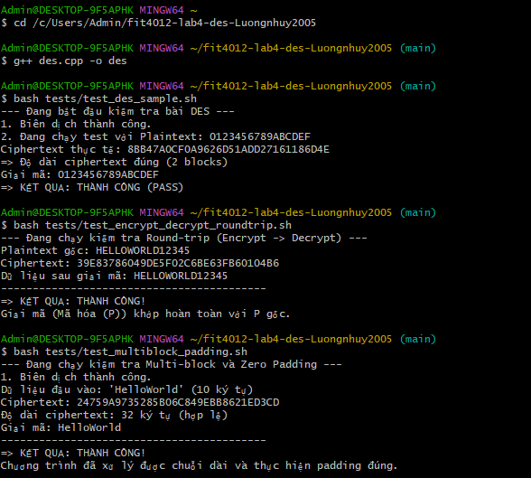
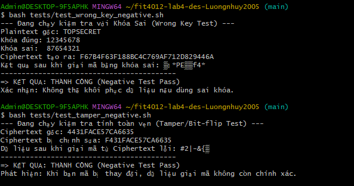
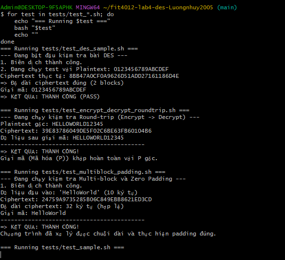
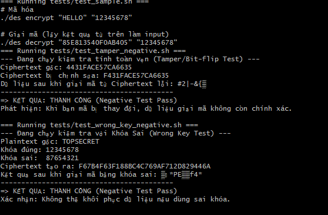

[](https://classroom.github.com/a/BJH8GGf3)
# FIT4012 - Lab 4: DES / TripleDES Starter Repository

Repo này là **starter repo** cho Lab 4 của FIT4012.  

## 1. Cấu trúc repo

```text
.
├── .github/
│   ├── scripts/
│   │   └── check_submission.sh
│   └── workflows/
│       └── ci.yml
├── logs/
│   ├── .gitkeep
│   └── README.md
├── scripts/
│   └── run_sample.sh
├── tests/
│   ├── test_des_sample.sh
│   ├── test_encrypt_decrypt_roundtrip.sh
│   ├── test_multiblock_padding.sh
│   ├── test_tamper_negative.sh
│   └── test_wrong_key_negative.sh
├── .gitignore
├── CMakeLists.txt
├── Makefile
├── README.md
├── des.cpp
└── report-1page.md
```

## 2. Cách chạy chương trình (How to run)

### Cách 1: Dùng Makefile

```bash
make
./des
```

### Cách 2: Biên dịch trực tiếp

```bash
g++ -std=c++17 -Wall -Wextra -pedantic des.cpp -o des
./des
```

### Cách 3: Dùng CMake

```bash
cmake -S . -B build
cmake --build build
./build/des
```

## 3. Input / Đầu vào

Chương trình hỗ trợ **3 cách nhập liệu**:

### Cách 1: Command line arguments
```bash
./des encrypt "HelloWorld" "12345678"
./des decrypt "85E813540F0AB405" "12345678"
```

### Cách 2: Interactive mode (không truyền tham số)
```bash
./des
# Nhập mode: encrypt hoặc decrypt
# Nhập plaintext/ciphertext
# Nhập key (8 ký tự)
```

### Cách 3: Từ stdin (cho CI)
- Dòng 1: Chọn mode (1=DES encrypt, 2=DES decrypt, 3=TripleDES encrypt, 4=TripleDES decrypt)
- Dòng 2: Plaintext (cho encrypt) hoặc Ciphertext hex (cho decrypt)
- Dòng 3: Key (8 ký tự)

**Định dạng dữ liệu:**
- **Plaintext**: Chuỗi ký tự ASCII (ví dụ: "HelloWorld")
- **Key**: 8 ký tự ASCII (ví dụ: "12345678")
- **Ciphertext**: Chuỗi hex 16 ký tự cho mỗi block (64 bits)
- **Hỗ trợ multi-block**: Plaintext dài hơn 8 bytes sẽ được tự động chia thành nhiều block 64-bit

## 4. Output / Đầu ra

- **Ciphertext**: Chuỗi hex in hoa (ví dụ: "85E813540F0AB405")
- **Round keys**: Có thể in round keys bằng cách truyền tham số verbose=true
- **Hỗ trợ giải mã**: Có hỗ trợ decrypt với cùng key
- **TripleDES**: Hiện tại sử dụng DES tiêu chuẩn (1 key 8 bytes)

## 5. Padding đang dùng

Chương trình sử dụng **Zero Padding**:

- **Cơ chế**: Nếu plaintext không chia hết cho 64 bits (8 bytes), thêm các bit '0' vào cuối cho đến khi đủ 64 bits
- **Multi-block**: Plaintext được chia thành các block 64-bit, mỗi block được mã hóa độc lập
- **Hạn chế của Zero Padding**:
  - Không thể phân biệt giữa dữ liệu thực và padding khi plaintext kết thúc bằng null bytes
  - Ví dụ: "ABC\x00\x00\x00\x00" và "ABC" sau padding đều thành "ABC\x00\x00\x00\x00"
  - Chỉ phù hợp cho mục đích học tập, không an toàn trong thực tế
- **Trong thực tế**: Nên dùng PKCS#7 padding hoặc các chuẩn padding khác

## 6. Tests bắt buộc

Repo này đã tạo sẵn **5 tên file test mẫu** để sinh viên điền nội dung:

- `tests/test_des_sample.sh`
- `tests/test_encrypt_decrypt_roundtrip.sh`
- `tests/test_multiblock_padding.sh`
- `tests/test_tamper_negative.sh`
- `tests/test_wrong_key_negative.sh`

Sinh viên phải tự hoàn thiện test và bổ sung minh chứng chạy.

## 7. Logs / Minh chứng

Thư mục `logs/` dùng để nộp minh chứng, ví dụ:
- ảnh chụp màn hình khi chạy chương trình
- output của test


- log thử đúng / sai key / tamper
- log cho mã hóa nhiều block


## 8. Ethics & Safe use

- Chỉ chạy và kiểm thử trên dữ liệu học tập hoặc dữ liệu giả lập.
- Không dùng repo này để tấn công hay can thiệp hệ thống thật.
- Không trình bày đây là công cụ bảo mật sẵn sàng cho môi trường sản xuất.
- Nếu tham khảo mã, tài liệu, công cụ hoặc AI, phải ghi nguồn rõ ràng.
- Khi cộng tác nhóm, cần trung thực học thuật và mô tả đúng phần việc của mình.
- Việc kiểm thử chỉ phục vụ học DES / TripleDES ở mức nhập môn.

## 9. Checklist nộp bài

Trước khi nộp, cần có:
- `des.cpp`
- `README.md` hoàn chỉnh
- `report-1page.md` hoàn chỉnh
- `tests/` với ít nhất 5 test
- có negative test cho `tamper` và `wrong key`
- `logs/` có ít nhất 1 file minh chứng thật
## ...existing code...

## 10. Lưu ý về CI

CI sẽ **không chỉ kiểm tra file có tồn tại** mà còn kiểm tra:
- các mục bắt buộc trong README
- các mục bắt buộc trong report
- sự hiện diện của negative tests
- có minh chứng trong `logs/`
## ...existing code...

Vì vậy repo starter này sẽ **chưa pass CI** cho tới khi sinh viên hoàn thiện nội dung.


## 11. Submission contract để auto-check Q2 và Q4

Để GitHub Actions kiểm tra được **Q2** và **Q4**, repo này dùng **một contract nhập/xuất thống nhất**.
Sinh viên cần sửa `des.cpp` để chương trình nhận dữ liệu từ **stdin** theo đúng thứ tự sau:

```text
Chọn mode:
1 = DES encrypt
2 = DES decrypt
3 = TripleDES encrypt
4 = TripleDES decrypt
```

### Mode 1: DES encrypt 
Nhập lần lượt:
1. `1`
2. plaintext nhị phân
3. key 64-bit

Yêu cầu:
- nếu plaintext dài hơn 64 bit: chia block 64 bit và mã hóa tuần tự
- nếu block cuối thiếu bit: zero padding
- in ra **ciphertext cuối cùng** dưới dạng chuỗi nhị phân

### Mode 2: DES decrypt
Nhập lần lượt:
1. `2`
2. ciphertext nhị phân
3. key 64-bit

Yêu cầu:
- giải mã DES theo round keys đảo ngược
- in ra plaintext cuối cùng

### Mode 3: TripleDES encrypt 
Nhập lần lượt:
1. `3`
2. plaintext 64-bit
3. `K1`
4. `K2`
5. `K3`

Yêu cầu:
- thực hiện đúng chuỗi **E(K3, D(K2, E(K1, P)))**
- in ra ciphertext cuối cùng

### Mode 4: TripleDES decrypt 
Nhập lần lượt:
1. `4`
2. ciphertext 64-bit
3. `K1`
4. `K2`
5. `K3`

Yêu cầu:
- thực hiện giải mã TripleDES ngược lại
- in ra plaintext cuối cùng

### Lưu ý về output
- Có thể in prompt tiếng Việt hoặc tiếng Anh.
- Có thể in thêm round keys hay thông báo trung gian.
- Nhưng **kết quả cuối cùng phải xuất hiện dưới dạng một chuỗi nhị phân dài hợp lệ** để CI tách và đối chiếu.

## 14. CI hiện kiểm tra được gì

Ngoài checklist nộp bài, CI hiện còn kiểm tra tự động:
- chương trình thực sự nhận plaintext/key từ bàn phím và mã hóa multi-block với zero padding đúng.
- chương trình thực sự mã hóa và giải mã TripleDES đúng theo vector kiểm thử.

Nói cách khác, nếu sinh viên chỉ sửa README/tests cho đủ hình thức mà **không làm Q2 hoặc Q4**, CI sẽ vẫn fail.
